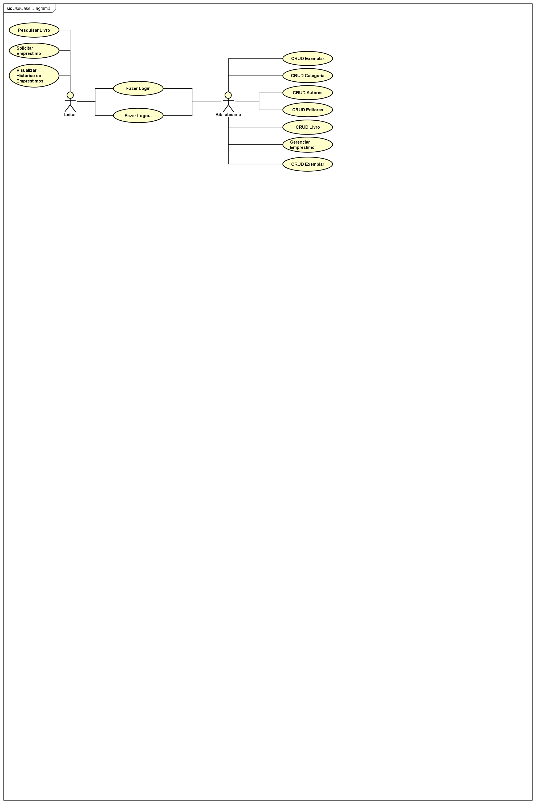
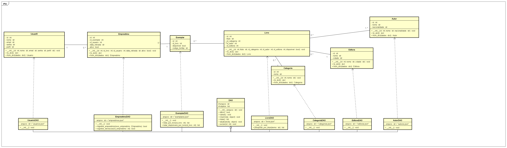

# BiblioTech
Pequeno sistema em terminal para a matéria de Programação Orientada a Objetos.

# 📚 BiblioTech — Sistema de Gestão de Biblioteca

> **IFRN | Tecnologia em Análise e Desenvolvimento de Sistemas**
> Avaliação de Programação Orientada a Objetos — 2º Bimestre

---

## 📖 Sobre o Projeto

O **BiblioTech** tem como finalidade automatizar e otimizar todo o gerenciamento do acervo físico de uma biblioteca. O sistema controla de maneira integrada o cadastro de **livros**, **categorias literárias**, **autores**, **editoras** e **usuários**, além de monitorar o ciclo de vida completo dos **empréstimos**. A solução visa garantir a consistência dos dados, impedir a retirada de livros indisponíveis e fornecer um histórico confiável de movimentações.

### 🎯 Descrição do Problema

Atualmente, o controle manual ou descentralizado do acervo gera desorganização crônica, falta de controle sobre prazos de devolução, perda física de exemplares e dificuldade de consulta por parte dos leitores. Adicionalmente, a ausência de uma validação automática permite que livros já emprestados sejam alocados incorretamente, inviabilizando uma gestão eficiente do fluxo interno.

---

## 👥 Perfis de Usuários (Atores)

### 🛠️ Bibliotecário (Admin)
Usuário gestor que possui privilégios totais no sistema. É responsável por realizar o CRUD completo de todas as entidades base (Usuários, Categorias, Autores, Editoras e Livros), além de supervisionar e auditar os empréstimos registrados.

### 👤 Leitor (Cliente)
Usuário final da biblioteca. Possui acesso restrito para consultar o catálogo do acervo por meio de pesquisas parciais por título e realizar solicitações de empréstimo de obras que estejam efetivamente disponíveis.

---

## ⚙️ Lista de Operações (Requisitos Funcionais)

1. **Autenticação de Usuários** — Controle de acesso permitindo entrar (Login) e sair (Logout) do sistema com base nas credenciais (e-mail e senha) e verificação do perfil (`admin` ou `leitor`).
2. **Gerenciamento (CRUD) de Entidades** — Operações completas de Inserir, Listar, Atualizar e Excluir para as seis entidades do modelo: `Usuario`, `Categoria`, `Autor`, `Editora`, `Livro` e `Emprestimo`.
3. **Operação de Associação 1:N** — No ato do cadastro de um Livro, o sistema realiza a vinculação obrigatória com IDs existentes das classes `Categoria`, `Autor` e `Editora`. Do mesmo modo, a classe `Emprestimo` associa-se diretamente a um `Livro` e a um `Usuario`.
4. **Operação de Pesquisa Parcial** — Mecanismo que permite listar parcialmente os livros armazenados no acervo através de um termo ou palavra informada pelo usuário (busca realizada de forma insensível a maiúsculas/minúsculas no atributo título).
5. **Regra de Negócio Complexa Multi-Entidade** — Lógica que manipula duas ou mais classes de persistência em um único fluxo de execução, garantindo a integridade transacional do negócio.

### 🔐 Regra de Negócio Crítica: Realização de Empréstimo

Ao acionar o método de registro de empréstimo, o sistema:

1. Abre o arquivo de persistência de livros;
2. Verifica se a obra correspondente ao ID informado existe e se o atributo `disponivel` é verdadeiro (`True`);
3. Caso positivo, altera o status do livro para falso (`False`), salvando a atualização em `livros.json`, e consolida o novo registro em `emprestimos.json`;
4. Se o livro estiver indisponível, a transação é cancelada e o empréstimo é rejeitado.

---

## 🧩 Diagrama de Casos de Uso

| Ator | Casos de Uso Associados | Relacionamento / Regras |
|---|---|---|
| **Bibliotecário (Admin)** | • CRUD de Usuários<br>• CRUD de Categorias<br>• CRUD de Autores<br>• CRUD de Editoras<br>• CRUD de Livros<br>• Listar/Excluir Empréstimos | Acesso completo e irrestrito de escrita e leitura de dados. |
| **Leitor (Cliente)** | • Pesquisar Livro (Nome Parcial)<br>• Solicitar Empréstimo de Livro<br>• Visualizar Meu Histórico de Empréstimos | Acesso restrito a consultas e operações próprias. |
| **Gerais (Ambos os Atores)** | • Efetuar Login<br>• Efetuar Logout | Os casos de uso de operações incluem a relação de dependência `<<include>>` apontando para "Efetuar Login". |

---

## 🏗️ Diagrama de Classes (Modelo e Persistência)

### Classes do Modelo (Módulo `Modules`)

| Classe | Atributos | Métodos Implementados |
|---|---|---|
| **Autor** | `id: int`<br>`nome: str`<br>`nacionalidade: str` | `__init__(id_autor, nome, nacionalidade)`<br>`to_dict(): dict`<br>`from_dict(dados: dict): Autor` |
| **Categoria** | `id: int`<br>`nome: str` | `__init__(id_categoria, nome)`<br>`to_dict(): dict`<br>`from_dict(dados: dict): Categoria` |
| **Editora** | `id: int`<br>`nome: str`<br>`cidade: str` | `__init__(id_editora, nome, cidade)`<br>`to_dict(): dict`<br>`from_dict(dados: dict): Editora` |
| **Usuario** | `id: int`<br>`nome: str`<br>`email: str`<br>`senha: str`<br>`perfil: str ('admin' \| 'leitor')` | `__init__(id_usuario, nome, email, senha, perfil)`<br>`to_dict(): dict`<br>`from_dict(dados: dict): Usuario` |
| **Livro** | `id: int`<br>`titulo: str`<br>`id_categoria: int` (Associação)<br>`id_autor: int` (Associação)<br>`id_editora: int` (Associação)<br>`disponivel: bool = True` | `__init__(id_livro, titulo, id_categoria, id_autor, id_editora, disponivel)`<br>`to_dict(): dict`<br>`from_dict(dados: dict): Livro` |
| **Emprestimo** | `id: int`<br>`id_livro: int` (Associação)<br>`id_usuario: int` (Associação)<br>`data_retirada: str`<br>`ativo: bool = True` | `__init__(id_emprestimo, id_livro, id_usuario, data_retirada, ativo)`<br>`to_dict(): dict`<br>`from_dict(dados: dict): Emprestimo` |

### Classes de Persistência (Módulo `DAO`)

A persistência baseia-se em uma classe abstrata mãe contendo os métodos genéricos de manipulação de arquivos JSON, herdada pelas subclasses específicas de cada entidade do modelo.

| Classe | Atributos de Classe (Estáticos) | Métodos de Classe (Mapeamento CRUD) |
|---|---|---|
| **DAO** (Classe Super/Mãe) | `arquivo: str = ""`<br>`objetos: list = []`<br>`classe_modelo: Class = None` | `inserir(obj): void`<br>`listar(): list`<br>`atualizar(obj_atualizado): void`<br>`excluir(id_obj): void`<br>`salvar(): void`<br>`abrir(): void` |
| **AutorDAO** | `arquivo = "autores.json"`<br>`objetos = []`<br>`classe_modelo = Autor` | Herança total de `DAO` |
| **CategoriaDAO** | `arquivo = "categorias.json"`<br>`objetos = []`<br>`classe_modelo = Categoria` | Herança total de `DAO` |
| **EditoraDAO** | `arquivo = "editoras.json"`<br>`objetos = []`<br>`classe_modelo = Editora` | Herança total de `DAO` |
| **UsuarioDAO** | `arquivo = "usuarios.json"`<br>`objetos = []`<br>`classe_modelo = Usuario` | Herança total de `DAO` |
| **LivroDAO** | `arquivo = "livros.json"`<br>`objetos = []`<br>`classe_modelo = Livro` | `pesquisar_por_titulo(termo: str): list` — método específico para pesquisa parcial |
| **EmprestimoDAO** | `arquivo = "emprestimos.json"`<br>`objetos = []`<br>`classe_modelo = Emprestimo` | `registrar_emprestimo(novo_emprestimo): bool` — método específico da regra multientidade |

---

## 📁 Estrutura de Arquivos

Para obter os pontos atribuídos à codificação, o projeto deve ser entregue estruturado em pacotes isolados, mantendo a conformidade com o script de testes automatizado fornecido (`teste.py`), o qual valida a gravação, persistência transacional de arquivos e leitura correta de objetos dinâmicos.

```
BiblioTech/
├── Modules/            # Subpastas para cada entidade do domínio
│   ├── Autor/
│   │   ├── Autor.py
│   │   └── AutorDAO.py
│   ├── Categoria/
│   │   ├── Categoria.py
│   │   └── CategoriaDAO.py
│   ├── Editora/
│   │   ├── Editora.py
│   │   └── EditoraDAO.py
│   ├── Usuario/
│   │   ├── Usuario.py
│   │   └── UsuarioDAO.py
│   ├── Livro/
│   │   ├── Livro.py
│   │   └── LivroDAO.py
│   └── Emprestimo/
│       ├── Emprestimo.py
│       └── EmprestimoDAO.py
├── DAO/
│   └── DAO.py           # Lógica central de serialização/deserialização em JSON
├── Jsons/                # Arquivos persistidos em tempo de execução
│   ├── autores.json
│   ├── categorias.json
│   ├── editoras.json
│   ├── usuarios.json
│   ├── livros.json
│   └── emprestimos.json
└── teste.py              # Script que executa o fluxo de testes exigido
```

### Descrição dos diretórios

- **`/Modules`** — Contém subpastas para cada entidade do domínio, abrigando as classes de modelo (ex: `Autor.py`, `Livro.py`) e as classes de persistência filhas (ex: `AutorDAO.py`, `LivroDAO.py`).
- **`/DAO`** — Contém o arquivo genérico `DAO.py` com a lógica central de serialização/deserialização em JSON.
- **`/Jsons`** — Diretório físico onde os arquivos persistidos (`livros.json`, `usuarios.json`, etc.) são manipulados em tempo de execução de forma isolada.
- **`teste.py`** — Arquivo de script na raiz que executa sequencialmente o fluxo de testes exigido pelo professor.

---

## 🏆 Critérios de Avaliação

| Item | Pontuação |
|---|---|
| Diagrama de Casos de Uso | 5 pontos |
| Diagrama de Classes | 10 pontos |
| Estrutura de Arquivos e Código (`teste.py`) | 20 pontos |

---

## 🚀 Tecnologias

- **Python** — Linguagem principal do projeto
- **JSON** — Formato utilizado para persistência de dados
- **Orientação a Objetos** — Herança, associação e encapsulamento aplicados ao domínio da biblioteca
## Diagrama de Classes e Persistência





